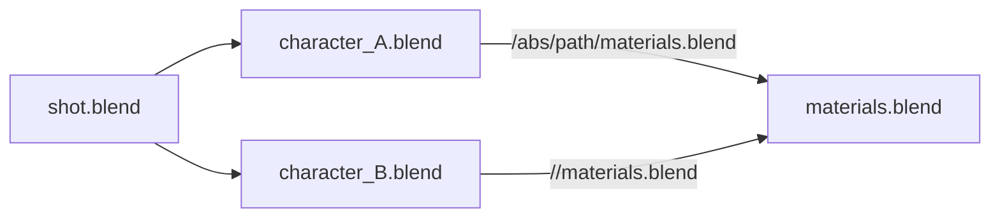

# Limitations

Blender Asset Tracer v2.x runs from within Blender, and uses Blender's Python
API to understand the structure of the loaded blend file. This means that when
Blender doesn't report certain dependencies, BAT is also unaware of them.

## Relative Paths to Blend Files

Absolute links between blend files are not supported. **When linking from other
blend files, always enable the Relative Path option.** This is enabled by
default, so when you don't change these options in Blender, everything should be
fine.

### Technical Background

The reason that absolute paths for linking blend files is not supported is quite
simple: Blender deduplicates these links, and **only the path that it loads first
will be visible** to the Python API.

To give an example, here is a graph of a blend file and its linked libraries. An
arrow means 'links data from'.



When loading `shot.blend`, it depends on the loading order of
`character_A.blend` and `character_B.blend` whether the Python API will expose
`/abs/path/materials.blend` or `//materials.blend` as the path of
`materials.blend`. And what's even worse: there is no information about which
file that path was read from, so it is not know whether `character_A.blend` or
`character_B.blend` needs to be rewritten to use a relative path.

To add support for this, BAT would need to open each linked blend file and
investigate which paths are used, in order to understand which file would need
path rewriting.

This means starting a background process, like what is already done for the
rewriting. However, BAT currently has two stages, an 'investigation' stage and
an 'execution' stage. This background process + loading each blend file would
have to happen in the investigation stage, making that significantly heavier. Of
course the found results can be cached somewhere, but it would add significant
complexity to the project.

## Blender's Known Issues

BAT v2.x requires Blender 5.1 or newer. However, there are a few known issues in
Blender 5.1.0 that cause certain dependencies to be missed:

- Blender 5.1.0 does not report legacy particle system cache files correctly.
  This is fixed in [blender!155720][pr155720], which will be part of Blender
  5.1.1.
- Blender 5.1.0 does not report Alembic file sequences correctly, see
  [blender#155774][i155774]. For now, BAT does not handle such files correctly
  either.
- Blender 5.1.0 does not report Geometry Nodes simulation cache files files, see
  [blender#155953][i155953]. As a result, BAT does not know about these files
  and will not report them as a dependency or pack them.

[pr155720]: https://projects.blender.org/blender/blender/pulls/155720
[i155774]: https://projects.blender.org/blender/blender/issues/155774
[i155953]: https://projects.blender.org/blender/blender/issues/155953

## Testing for Missing Dependencies

To test cases like the above limitations, run the following in Blender's Python
console. It should report the files in use by the current blend file:

```py
>>> {k: v for (k, v) in D.file_path_map().items() if v}
{bpy.data.objects['Plane']: {'//meshcache.mdd'}}
```

If this does _not_ report files you know are in use by your project, please
[file a bug report against Blender itself][bugreport].

[bugreport]: https://docs.blender.org/manual/en/latest/troubleshooting/report_bug.html
